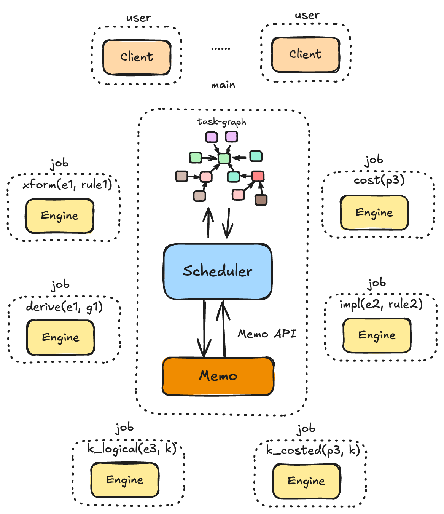
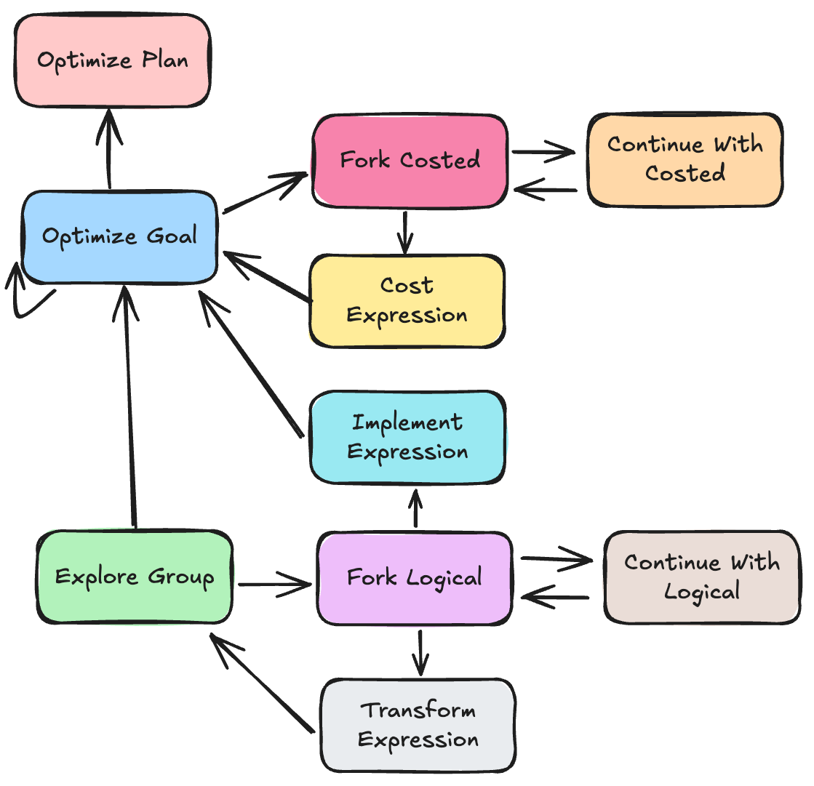

# Core Optimizer

## Overview

> What motivates this to be implemented? What will this component achieve?
> 

The core optimizer in optd is a cost-based optimization framework that finds optimal physical execution plans. It works by enumerating possible plans specified by user-defined rules, operators, and properties, then evaluates the cost of each plan using a pluggable cost model.

Our optimizer brings the following contribution:

- **On-demand Exploration:** The optimizer only expands equivalent expression classes if the rule asked for an expansion.
- **Flexible Scheduling Policy:** The optimizer’s scheduling policy is flexible and the end user gets gradually improving physical plans.
- **Inter-query Parallelism:** The optd query optimizer supports optimizing multiple queries at the same time using a single optimizer instance.
- **Intra-query Parallelism:** The ****optimization rules and costing procedures can run completely in parallel.
- **Persistent Memoization:** The memo table is persisted across sessions and optimization progress is cached between sessions.

## Scope

> Which parts of the system will this feature rely on or modify? Write down specifics so people involved can review the design doc
> 

The core optimizer has been built from scratch, incorporating lessons learned from the optd-original optimizer. We extensively studied Cascades-style query optimizers from Microsoft, Columbia, and CockroachDB. The optimizer relies on the DSL and rule engine implementation for operator and property definitions, as well as rule execution.

## Glossary (Optional)

> If you are introducing new concepts or giving unintuitive names to components, write them down here.
> 

### Logical expression

### Group

### Physical Expression

### Goal

### Goal Member

### Task

A **task** represents a higher-level objective in the optimization process. It consists of structured, hierarchical components that may depend on other tasks. To achieve its optimization objective, a task can spawn a job coroutine. Some tasks may not spawn a job but is there just to organize its subtasks. For instance, an `ExploreGroup` task dispatches work to `TransformExpression` subtasks and does not spawn a job itself.

### Job

A **job** represents a discrete unit of work within the optimization process.

## Architectural Design

> Explain the input and output of the component, describe interactions and breakdown the smaller components if any. Include diagrams if appropriate.
> 

As shown in the above diagram, the optimizer consists of a main coroutine, multiple job coroutines, and multiple client coroutines. The client and job coroutines communicate with the main coroutine through message passing. The main coroutine functions as an event loop that processes messages from the client and job coroutines, persists state in the memo table, creates additional tasks in the task graph, and schedules jobs for execution on other job coroutines. The following section describes 

For each query instance, a client will submit the initial logical plan (converted from the input SQL query) to the query optimizer and gradually receive better physical plans.

### Task Graph (WIP)

**OptimizePlan** 

The objective of an `OptimizePlan` task is to find the best execution plan for a specific query instance. Upon receiving a request to optimize a query instance, the optimizer will ingest the initial logical plan into the memo table and create this task. The `OptimizePlan` task can only have one dependent `OptimizeGoal` task, where the goal is to optimize the group of the root logical expression with default physical property.

**OptimizeGoal**

The objective of an `OptimizeGoal` task is to find the best costed physical expression that satisfies the required logical and physical properties for that goal. This task can create an `ExploreGroup` subtask and `ImplementExpression` subtasks, and `CostExpression` subtasks. It could also create other member `OptimizeGoal` subtasks.

**ExploreGroup**

The objective of a `ExploreGroup` task is to discover equivalent logical expressions. The task itself does not schedule any jobs. Instead it will create a set of `TransformExpression` tasks to apply transformation rules. 

TransformExpression

The objective of a `TransformExpression` task is to generate an equivalent logical expression by applying a transformation rule. 

**ImplementExpression** 

The objective of an `ImplementExpression` task is to generate a physical expression from a logical expression with some required physical properties.

**CostExpression**

The objective of a `CostExpression` task is to compute the cost of a physical expression based on the cost of the best costed physical expressions from its children goals. 

**ForkLogical**

The objective of a `ForkLogical` task is to expand an unmaterialized group specified in the engine and fork the execution for each logical expression.

**ContinueWithLogical**

The objective of a `ContinueWithLogical` task is to continue executing the callback and make progress toward generating new logical / physical equivalent plans.

**ForkCosted**

The objective of a `ForkCosted` task is to expand an unmaterialized goal specified in the engine and fork the execution for the best costed expression.

**ContinueWithCosted**

The objective of a `ContinueWithCosted` task is to continue executing the callback and make progress toward costing a physical expression.

### Key Operation 1: Merge

### Key Operation 2: Forward

### Misc

## Design Rationale

> Explain the goals of this design and how the design achieves these goals. Present alternatives considered and document why they are not chosen.
> 

### On-demand Exploration

The core optimizer only expands equivalent expression classes when a rule explicitly requests expansion. Unlike Volcano, which applies all logical-to-logical transformation rules before costing alternatives—often causing plan space explosion and preventing timely physical plan generation. The Microsoft Cascades (EQOP) optimizer enables non-exhaustive exploration through adding guidance to the search, but when applying a rule to an expression, it explores all children groups even if unnecessary. The Columbia optimizer improves this by expanding children groups to equivalent logical expression bindings only when the rule matches the top node tag (e.g., a `Join`). However, this approach still explores more than necessary. For example, given a rule matching `Join(left: Project(*), right: *)`, Columbia will explore the right child group of a `Join` node even though the rule accepts any expression on the right side.

We achieve on-demand exploration by registering callbacks written in continuation-passing style. When the engine evaluates a rule against an expression and tries to match an operator with an unmaterialized group ID, it creates a callback that takes an expanded expression and continues execution. This callback is sent back to the optimizer as a message. The optimizer then creates new tasks to fork the execution and schedules the callbacks to be applied to each expanded expression. 

### Flexible Scheduling Policy

The optimizer's scheduling policy is flexible, enabling users to receive progressively better physical plans. The scheduler manages job execution to enumerate the search space and evaluate alternative plan costs. This flexible scheduling allows us to balance between quickly obtaining an initial plan and expanding the search space to find potentially superior plans. Our optimizer can even emulate Cascades behavior by executing jobs in LIFO order. 

Moreover, our approach transforms guidance into a scheduling problem, prioritizing jobs that explore promising search spaces and generate better physical plans. Unlike Microsoft's heuristics-based guidance, our approach offers greater extensibility and allows scheduling to be guided by both human hints and machine learning techniques.

### Inter-query Parallelism

The core query optimizer can optimize multiple queries simultaneously using a single optimizer instance. This is possible because queries can share optimization results for subexpressions, not just the root plan. The optimizer only needs to track the root optimization objective (the `OptimizeGoal` task) for each query instance. As better physical plans become available for a goal, the optimizer sends them to the respective query instance through a channel.

### Intra-query Parallelism

The optimization rules and costing procedures can run fully in parallel. After launching a rule call or costing procedure on the job coroutine, it runs independently until requiring further expansion or returning results to the main coroutine. 

One alternative design would make the memo table thread-safe. We rejected this approach since memo table updates are computationally expensive, and simply adding a lock would provide minimal benefit. In the future, we could explore a single-writer, multi-reader design allowing shared read-only operations on the memo table (such as group expansion and property retrieval). With that design, we need to design task graph update more carefully.

### Persistent Memoization (TODO)

*This is on the roadmap and will be back-filled once we come up with a good design.*

The memo table is persisted across sessions and optimization progress is cached between sessions.

## Testing Plan

- Unit tests for the memo table API implementation.
- Unit tests for engine execution functionality.
- Testing the optimizer with hand-crafted operators and rules.

Once we achieve full end-to-end integration with an execution engine, we can validate results by comparing the output of physical plans from both the engine's default optimizer and our optimizer.

## Trade-offs and Potential Problems

> Write down any conscious trade-off you made that can be problematic in the future, or any problems discovered during the design process that remain unaddressed (technical debts).
> 

## Future Work

> Write down future work to fix known problems or otherwise improve the component.
> 

**Resource Management**

**Fairness** when optimizing multiple query instances at the same time.